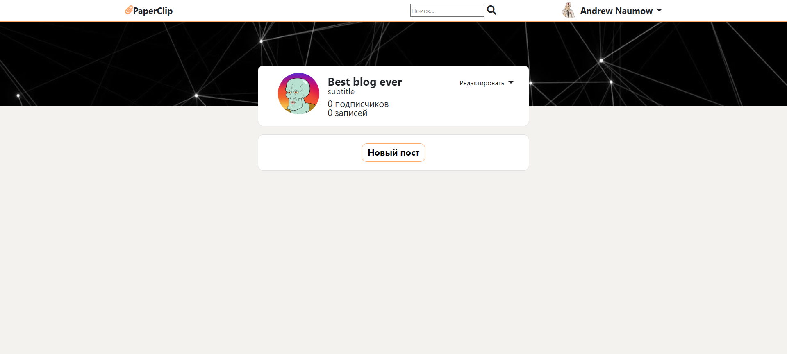

####### Перед использованием в "db.properties" указать данные к бд и при деплое "Application context" установить на "/".
В рамках учебного проекта написал свой веб-сервис для создания
личного блога с возможностью редактирования и публикации статей
в формате «markdown text», реализовал базовые возможности такие
как регистрация, авторизация, редактирование профиля, «лайки»,
подписки и комментирование. Большинство функционала доступно
через RESTful API. Для реализации редактора была использована
сторонняя javascript библиотека «Editor.md» для «парсинга» текста в
формате «markdown text», написано 7000 строк Java кода. 
Использовал такие технологии:
- Spring MVC
- Spring Security
- Spring Data Jpa
- Spring Session
- Hibernate
- PostgreSQL
- Freemarker
- Bootstrap
- JQuery

страница регистрации:\

страница входа:\

страница профиля:\

страница создания блога:\

стартовая строница блога:\

Для того, чтобы создать первый пост, нажмите на кнопку "Новый пост".\
окно создания поста:\

слева mdText, справа результат\
созданный пост:\

кнопка редактировать, можно редактировать блог, создать панель слева или справа:\

Для того, чтобы увидеть посты другого блога нужно подписаться:\

Созадаются по умолчанию блоги по урлам \
- "/superBlog":

- "/pro100Blog":

- "/helloBlog":

Посты можно лайкать и комментировать:

